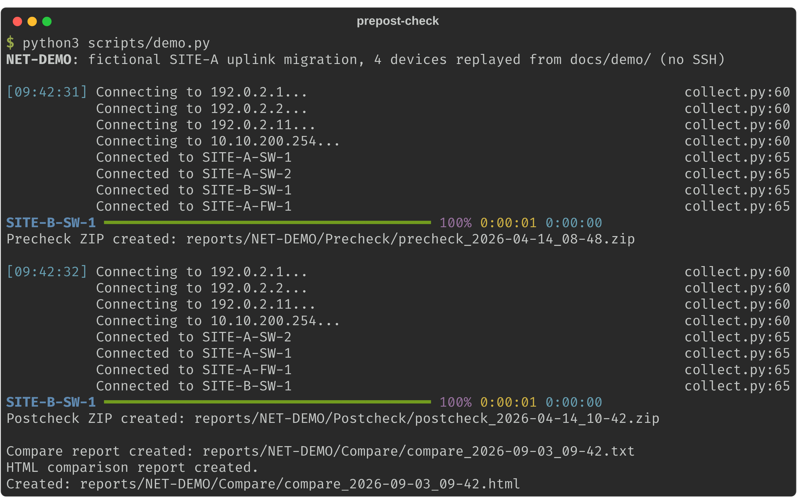
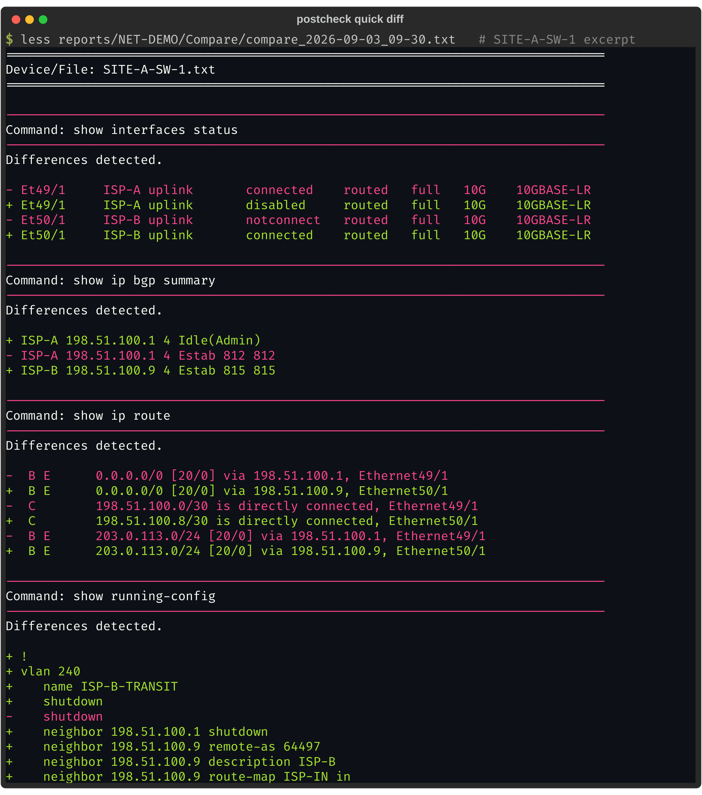
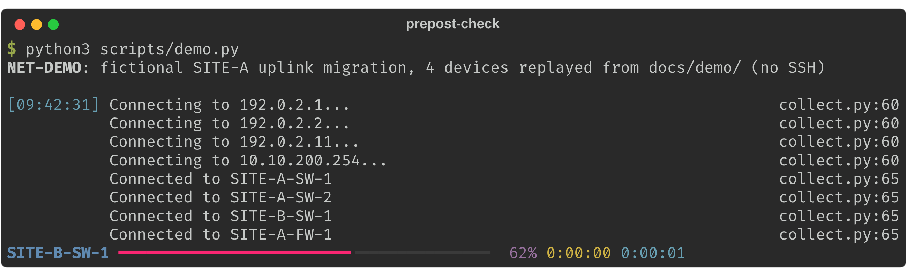
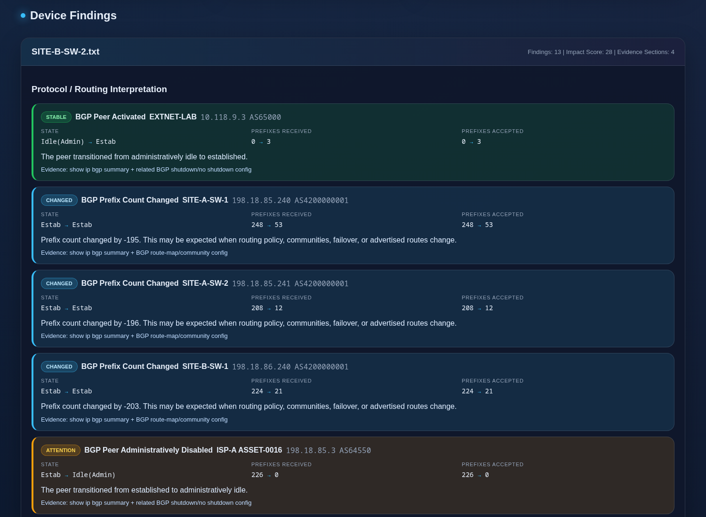
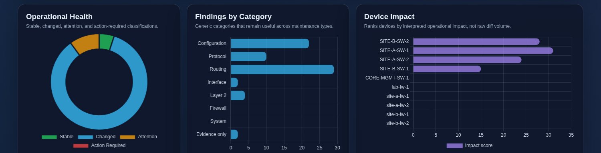

# mw


[](https://github.com/fnitguy-tech/netshell/actions/workflows/ci.yml)
[](https://github.com/fnitguy-tech/netshell/releases)
[](https://crates.io/crates/mw-check)

**Maintenance window check.** Capture your network devices before a
change, capture them again after, and get told what actually changed.

You get a quick text diff for the on-call view, and an interpreted HTML
report with impact-rated findings for everyone else.

```text
mw before NET-123 -r      capture before the change, secrets stripped
   (do the change)
mw after  NET-123 -r      capture after the change, quick text diff
mw report NET-123         the interpreted HTML report
```

One static binary for Windows, macOS and Linux. No Python, no venv,
nothing to install. Every command it sends to a device is a read-only
`show`. Arista EOS, Cisco IOS/IOS-XE/NX-OS/IOS-XR, Juniper Junos and
Palo Alto PAN-OS over SSH, through this repository's own
[`netshell`](crates/netshell/) driver.


## What it tells you

A 10-device window, condensed from the full
[sample report](docs/sample-report.html) (download it and open it in a
browser; GitHub does not render repository HTML):

```text
NET-2043   Network Health: ATTENTION    devices 10 · changed 34 · attention 4

SITE-B-SW-2    Attention 1 · Action Required 0 · Impact 28
  BGP Peer Activated        EXTNET-LAB  10.118.9.3  AS65000
    State                   Idle(Admin) → Estab
    Prefixes Received       0 → 3
    Evidence: show ip bgp summary + related BGP shutdown/no shutdown config

SITE-A-SW-1    Attention 1 · Action Required 0 · Impact 31
  BGP Prefix Count Changed  198.18.85.240  AS4200000001
    Prefixes Received       248 → 53
```

Every finding links to the raw before/after diff behind it. All
hostnames, addresses and ASNs in the sample are fictional.

## Install

```text
cargo install mw-check                               # any OS with Rust; the binary is mw
scoop bucket add fnitguy https://github.com/fnitguy-tech/netshell
scoop install mw                                     # Windows, Scoop
```

Or download `mw` for your platform from the
[latest release](https://github.com/fnitguy-tech/netshell/releases/latest).
`SHA256SUMS` sits next to the binaries, and each one carries a GitHub
build provenance attestation:

```text
gh attestation verify mw-windows-x86_64.exe --owner fnitguy-tech
```

The binaries aren't code-signed yet, so a direct download gets the
SmartScreen prompt on first run on Windows; a Scoop or cargo install
does not.

## Try it in 60 seconds, no devices

```text
mw demo
```

That runs the whole workflow on a bundled fictional four-device uplink
migration ([scenario](crates/mw-check/fixtures/NET-DEMO/SCENARIO.md)) -
the parallel collector, the zip packaging, the quick text diff, and the
HTML report. It all lands in `reports/NET-DEMO/` under the current
directory. No SSH happens; a stub replays the bundled captures.



Open `reports/NET-DEMO/Compare/compare_<timestamp>.html` for the
interpreted report. The `.txt` next to it is what the on-call engineer
reads before leaving the window:



Now notice what *isn't* in that diff. Uptime, BGP message counters, OSPF
dead timers, and optic readings all moved between the two captures. The
normalizer dropped every one. SITE-B-SW-1 wasn't touched by the change,
so it reports "No meaningful changes detected."

## Run it against your network

Pick a folder for your captures and run `mw init` in it. That writes
`inventory/devices.example.yml` and makes `reports/`. Copy the example to
`inventory/devices.yml`, put your devices in it, then from that folder:

```text
mw before NET-123 -r
   (do the change)
mw after NET-123 -r
mw report NET-123
```

The ticket is the first argument. Leave it off and you'll be prompted.
`-u` gives the SSH username; without it you're prompted for that too.
The password is always prompted, never a flag. A ticket has to be a
plain name like `NET-123`, because it becomes a folder.

Devices are read five at a time behind a live progress bar. An
unreachable one is logged and recorded as a `<host>_FAILED.txt` finding,
and the run keeps going.



Everything lands under `reports/<TICKET>/` in the current directory, or
under `$MW_HOME` when that is set:

```text
reports/<TICKET>/
  Precheck/precheck_<timestamp>/<hostname>.txt   (+ .zip)
  Postcheck/postcheck_<timestamp>/<hostname>.txt (+ .zip)
  Compare/compare_<timestamp>.txt / .html
  notes.md           (optional: your account of the window)
```

Run folders are stamped to the second (`precheck_2026-04-14_08-48-05`),
so two runs in the same minute get a folder each.

Hostnames come from the devices, so they're cleaned before they become
file names: `2001:db8::1` is saved as `2001_db8__1.txt`. If two devices
report the same hostname, both files get the address added
(`localhost_192.0.2.1.txt` and `localhost_192.0.2.2.txt`), and neither
overwrites the other.

The Python tool's names (`precheck`, `postcheck`, `compare`) still work
as aliases. The capture files use the same format too, so you can mix
captures and reports from
[prepost-check](https://github.com/fnitguy-tech/prepost-check) and `mw`
on one `reports/` tree.

### How to tell if the capture worked

**The last lines of `mw before` or `mw after` tell you if you can trust
it.** A capture that missed a device is not a baseline. You want to know
that now, not after the window has closed.

You get one summary line:

```text
7 of 8 captured; 1 failed: 10.0.0.5 (authentication failed)
```

`SUCCESS` prints only when every device was captured in full. Anything
less prints `INCOMPLETE`. `mw` also leaves with an exit code, so a
wrapper script can stop on a bad capture:

| Exit code | What happened | Example summary line |
|-----------|---------------|----------------------|
| `0` | Every device was captured in full. | `8 of 8 captured.` |
| `1` | Some devices were captured, and some weren't. | `7 of 8 captured; 1 failed: 10.0.0.5 (unreachable)` |
| `2` | No device was captured. | `0 of 8 captured; 1 failed: 10.0.0.5 (authentication failed); 7 not attempted` |

Two other cases share those codes. A flag `mw` doesn't accept, or a
ticket it can't use as a folder name, also exits `2`. That's the usual
code for a usage error. A run that can't start for another reason, such
as a missing inventory, exits `1` with the reason on the last line.

The words in brackets are the short reason: `authentication failed`,
`unreachable`, `name not found`, `host key changed`,
`enable secret needed`, `SSH connection failed`, or `capture failed`.
The full error is in that device's `<host>_FAILED.txt`.

**A slow command can't shift later answers.** Say `show ip bgp` takes
longer than the 180-second limit. The device is still sending that
output, and the next command would read it as its own answer. So the
rest of that device's commands are skipped and marked in the capture:

```text
### show running-config ###
--------------------------------------------------------------------------------
SKIPPED after timeout on show ip bgp
```

The summary line counts that device as incomplete, and the exit code is
`1`:

```text
7 of 8 captured; 1 incomplete: SITE-A-SW-1 (timeout on show ip bgp)
```

### A wrong password is tried once

**A mistyped password is tried on one device, and then the run stops.**
Most networks check logins against one central server, and that server
locks an account after a few bad tries. At five devices at a time, one
typo could lock you out in the first second of your window.

So the first connection goes alone. Once a device accepts the password,
the rest connect five at a time. If a device rejects it, no more devices
are tried, and the run tells you which one said no:

```text
INCOMPLETE
0 of 8 captured; 1 failed: 10.0.0.5 (authentication failed); 7 not attempted
Stopped early: 10.0.0.5 rejected the username or password. Check the password, then run again.
```

Each device that wasn't tried gets a `<host>_FAILED.txt` that starts
with `NOT ATTEMPTED`, so the reports still list it.

One limit to know about. After the password has worked once, devices
connect in parallel. If one of them then rejects it, new connections
stop, but up to four that had already started will finish.

### SSH host keys

**Each device's SSH host key is checked before your password is sent.**
Your password goes to whatever answers at the device's address. The host
key is the only thing that tells the real device from something else on
that address.

It works the way `ssh` does. The first time you connect to a device, its
key is saved, one line per device:

```text
192.0.2.11:22 ssh-ed25519 SHA256:nThbg6kXUpJWGl7E1IGOCspRomTxdCARLviKw6E5SY8
```

Every later run compares the device's key to that line. If it's
different, the connection is refused, and the device is recorded as
failed with the reason `host key changed`:

```text
The SSH host key for 192.0.2.11 has changed, so the connection was refused before any password was sent.
  Key on file:  ssh-ed25519 SHA256:nThbg6kXUpJWGl7E1IGOCspRomTxdCARLviKw6E5SY8
  Key offered:  ssh-ed25519 SHA256:uNiVztksCsDhcc0u9e8BujQXVUpKZIDTMczCvj3tD2s
  File:         /home/you/.config/mw/known_hosts (line 3)
If this device was replaced or re-imaged, that's expected. To accept the new key, run again with:
  --accept-new-host-key 192.0.2.11
The new key then replaces line 3. If nothing was replaced, stop and find out what's answering at that address.
```

Where the file lives, and how to change that:

| You want | Do this |
|----------|---------|
| The default on Linux and macOS | Nothing. It's `~/.config/mw/known_hosts` (or `$XDG_CONFIG_HOME/mw/known_hosts`). |
| The default on Windows | Nothing. It's `%APPDATA%\mw\known_hosts`. |
| Another file for every run | Set the `MW_KNOWN_HOSTS` environment variable to its path. |
| Another file for one run | Pass `--known-hosts /path/to/file`. |
| To accept one device's new key | Pass `--accept-new-host-key 192.0.2.11`, with the host as the inventory names it. Repeat the flag for more devices. |
| No checking at all | Pass `--insecure-accept-any-host-key`. Any key is accepted and nothing is saved. Use it only on a lab you trust. |

`mw` keeps its own file and never reads or changes `~/.ssh/known_hosts`.
It doesn't share a file with `netshell` or with prepost-check either:
each tool records the devices it has seen. Several devices can connect
at once, and each new key is added as one whole line.

### Old devices and enable mode

Three more flags cover the cases that come up in a real fleet. They work
on `mw before` and `mw after`:

| Flag | When you need it |
|---|---|
| `--legacy-algorithms` | An old device offers only SHA-1 or CBC algorithms, such as `3des-cbc`. They're off by default. |
| `--enable` | A Cisco IOS, IOS-XE, or Arista EOS login lands at `RTR-1>` and you need `RTR-1#`. You're prompted for the enable secret. It's never a flag. |
| `--user-mode` | You want to stay at `RTR-1>`. Commands like `show running-config` then fail, and the capture says so. |

Without `--enable` or `--user-mode`, a login that lands at `>` fails
that device with the reason `enable secret needed`. A capture taken in
user mode is missing the running config, and you'd only find out later.

### Keeping passwords out of the evidence

A running-config capture carries every secret on the box: `secret sha512
$6$...`, BGP `password 7`, TACACS keys, SNMP communities, private keys,
and PAN-OS `phash` / `-AQ==` values.

`-r` turns every one of them into `<REDACTED>` before anything is written
to disk. The text files, the zip, and the reports never hold the real
value. Use it on both captures.

The keyword and type marker stay, so you still see
`username admin secret sha512 <REDACTED>`. That means a credential added
or removed during the window still shows up as a change. Here's the
trade-off: a password *rotated* to a new value looks identical before and
after, so you won't see it.

What gets redacted:

| Kind of secret | Example line, after redaction |
|----------------|-------------------------------|
| Local users and enable passwords | `username admin secret sha512 <REDACTED>` |
| Arista type `8a` on `password`, `secret`, and `key` | `neighbor 10.0.0.3 password 8a <REDACTED>` |
| TACACS+ and RADIUS keys, one-line form | `tacacs-server host 10.1.1.1 key 7 <REDACTED>` |
| TACACS+ and RADIUS keys, IOS-XE block form | ` key 7 <REDACTED>` under `radius server RAD-1` |
| SNMP communities, including trap hosts | `snmp-server host 10.0.0.9 version 2c <REDACTED>` |
| SNMPv3 auth and privacy keys | `auth sha <REDACTED> priv aes <REDACTED>` |
| NTP keys | `ntp authentication-key 5 md5 <REDACTED>` |
| OSPF, IS-IS, and BGP keys | `ip ospf message-digest-key 1 md5 <REDACTED>` |
| HSRP and VRRP keys | `standby 10 authentication <REDACTED>` |
| Key chains | `key-string <REDACTED>` |
| IPsec pre-shared keys | `crypto isakmp key <REDACTED> address 192.0.2.1` |
| Junos quoted secrets | `pre-shared-key ascii-text <REDACTED>;` |
| PAN-OS set format | `set mgt-config users admin phash <REDACTED>` |
| PAN-OS XML | `<phash><REDACTED></phash>` |
| Private keys in PEM form | Everything between the `BEGIN` and `END ... PRIVATE KEY` lines |

Each kind is caught with or without a type marker, so `key-string 7 0A1B`
and a plain `key-string MyKey` are both covered. Certificates are public
and stay as they are. A private key is redacted wherever it sits,
including inside a certificate bundle.

Three catch-alls back the rules up, and they fire whatever keyword comes
first: crypt-style `$6$` hashes, Junos and IOS `$9$` values, and PAN-OS
`-AQ==` blobs.

The rules are in [`redact.rs`](crates/mw-check/src/redact.rs), one
commented pattern per rule, and
[`redact_rules.rs`](crates/mw-check/tests/redact_rules.rs) holds one
example for each. They're the same rules prepost-check runs, and both
tools are tested against the same lines. Redaction is a safety net, not
a guarantee: a vendor's new keyword won't be caught until it has a rule.
Read a capture before you post it somewhere public.

## What the report interprets

A raw `show` diff is noise on its own - uptimes, ARP timers, and BGP
message counters all move every second. Each command gets a normalization
rule that strips the churn, so what's left is real change. On top of
that, the report understands:

- **BGP peers.** Summary tables (EOS, IOS, NX-OS) and PAN-OS peer
  blocks are parsed into per-peer state, prefix counts, and uptime. A
  peer going `Estab → Idle(Admin)` right after a `neighbor x.x.x.x
  shutdown` line appeared in the config is one finding with its
  evidence. A session whose uptime went *backwards* is a reset, even
  when it reads `Estab → Estab`. Prefix deltas cite the prefix-list,
  route-map and policy lines that changed.
- **Prefix lists**, entry by entry. A removed permit is `Attention`, and
  so is an entry replaced at the same sequence number - the classic
  Arista replace-by-sequence trap. An entry that just moved is `Changed`.
  A new one is `Stable`.
- **Pair symmetry.** The two members of a redundant pair get compared
  against each other: same-named prefix-lists, route-maps, and PAN-OS HA
  state. "SW-1 and SW-2 now disagree" is invisible to a per-device
  report, so it gets its own section near the top. Route-map comparison
  skips the knobs a pair is meant to differ in, like prepend depth and
  local-preference.
- **Interfaces** that gained an address during the window and are still
  down. The config is fine and the link isn't.
- **Prefix-count changes.** A peer whose received or accepted count moved
  is `Changed`, with the caveat that routing policy, communities,
  failover, and advertised routes all move it legitimately. Whether this
  particular move was meant to happen is a judgement, so it goes in your
  notes rather than in a rating.





**A device you couldn't check is never reported as fine.** Say `SW-1`
answered before the change and is unreachable after it. Both reports put
it first:

```text
ACTION REQUIRED: 1 device(s) could not be verified
! SW-1 (10.0.0.5): Device unreachable after the change
    Before: Captured. After: Failed.
    Evidence: 10.0.0.5_FAILED.txt in the postcheck folder
    | could not connect to 10.0.0.5:22: Connection refused (os error 111)
```

In the HTML report the health verdict becomes `Action Required`, and the
device is listed under "Devices Not Verified" above everything else,
with the connect error as evidence. It counts in "Devices Checked" too.
The same goes for a device that failed before the change, one that's
missing from the after capture, and one that only shows up after.

**Two warnings guard the baseline.** Both print on the console and sit
at the top of both reports:

- *The before capture is newer than the after capture.* Say you ran
  `mw before` at 08:48, made the change, then ran `mw before` again at
  10:40 by mistake. The comparison would be "after against after" and
  show no change at all. Now you're asked:
  `The before capture is newer than the after capture. Did you run
  before again by mistake?`
- *A capture didn't finish.* A run stopped by Ctrl-C or a crash is
  missing devices. Each finished run writes a small marker file,
  `capture-complete.json`, as its last step. A folder without one is
  called out by name. Captures made by an older version never had
  markers, so those still compare, with a one-line note on the console.

**A huge rewrite still diffs fast.** When one block of lines replaces
another, the diff pairs up similar lines. That costs old lines times new
lines: 200 against 200 is 40,000 pairs, and 5,000 against 5,000 would be
25 million. Above 40,000 pairs the block is written plainly, every
removed line and then every added line. The same lines appear either
way.

The HTML report is one self-contained file. Its one outside file is
Chart.js, pinned to an exact release and checked against a hash before
your browser runs it. If the CDN can't be reached, the charts are
replaced by a short note and the rest of the report is complete. It
carries the health verdict
(`Stable / Changed / Attention / Action Required`) and a per-device impact
score. Under that, every finding with its before and after state, the
category and impact charts, and each raw diff folded into a collapsible
section.

## Configuring the inventory

`inventory/devices.yml` groups devices by platform. Each platform carries
its netmiko-style `device_type` and the commands to capture for it. So
adding a device, a command, or a whole platform never means touching
code:

```yaml
platforms:
  - name: arista
    device_type: arista_eos        # arista_eos, cisco_ios, cisco_nxos, cisco_xr, juniper_junos, paloalto_panos
    hosts:
      - 192.0.2.11
    commands:
      - show ip bgp summary
      - show running-config
```

The example inventory carries curated command lists for Arista EOS and
PAN-OS. The PAN-OS list adds IPsec/IKE tunnel state and LSVPN
hub/satellite status. Those are normalized, so SPIs, rekey timers, and
satellite login times never read as changes - but a tunnel going
`active → init` does.

**Redundant pairs.** Hostnames that differ only by a trailing number
are paired automatically. Pairs not named that way go in an optional
top-level list:

```yaml
pairs:
  - [CORE-EAST, CORE-WEST]
  - [EDGE-FW-PRIMARY, EDGE-FW-SECONDARY]
```

`mw report` reads nothing but that list, so `mw report NET-123 -i
pairs.yml` works with a file that holds only `pairs:`. A capture needs
the `platforms:` list too, and says so if it's missing.

**Your write-up.** The report says what changed. It can't say why you
changed it, what surprised you, or what you only noticed afterwards.
`mw notes NET-123` writes `reports/<TICKET>/notes.md`, seeded with the
ticket, the window times, and the devices your captures hold, under five
headings:

```markdown
## What we set out to do
## What actually happened
## What we missed
## Still open
## Would do differently
```

Fill it in with any editor and `mw report` renders it above the machine
findings. Bullets, `- [ ]` and `- [x]` checkboxes, `` `code` `` and
`**bold**` all work, and open checkboxes get counted. A section you leave
empty is left out, a template with nothing filled in renders nothing at
all, and it never overwrites notes you already started.

A comment is dropped only when it starts its line with `<!--`. It can
run over several lines, up to the next `-->`. A line of your own that
ends in an arrow, like `Et49/1 went down --> traffic moved to Et50/1`,
is kept as text. If the notes file is there but can't be read, the
report is still built, and the console tells you why:
`WARNING: The notes file reports/NET-123/notes.md exists but couldn't be
read (Permission denied). The report is being built without your notes.`

**A per-change inventory.** Copy the parts of `devices.yml` you need into
a file named for the change and pass it with `-i`. The capture then covers
only the devices in scope, and it can carry the commands that prove that
one change.

## netshell, the driver underneath

[`netshell`](crates/netshell/) is the SSH piece on its own. Open a shell,
turn paging off, send `show` commands, get clean output back - for the
six platforms above. It's what `mw` collects with, and you can use it
alone as a library or a CLI:

```text
netshell --platform arista_eos --host 192.0.2.11 --username admin "show version" "show ip bgp summary"
```

It checks host keys the way `ssh` does. The first connect to a device
records its key. If the key ever changes, netshell refuses to connect
and tells you which line of the known-hosts file to remove. This is new
in 0.2.0: before, any host key was accepted.

A few flags cover the cases that come up in a real fleet:

| Flag | When you need it |
|---|---|
| `--accept-new-host-key` | You replaced or re-imaged a device, so its key changed. |
| `--legacy-algorithms` | An old device offers only SHA-1 or CBC algorithms, such as `3des-cbc`. |
| `--enable` | A Cisco IOS, IOS-XE, or Arista EOS login lands at `RTR-1>` and you need `RTR-1#`. |

It exits 0 when every command ran, 1 when it couldn't connect, and 3
when a command failed, so a script can tell those apart. The
[netshell README](crates/netshell/README.md) has the known-hosts file
format, the exact errors, and the `cli` cargo feature for library
users.

## Repository layout

```text
crates/mw-check/      the mw binary (package mw-check on crates.io)
  src/commands/       before, after, report, notes, demo
  src/collect.rs      parallel SSH capture, zip packaging, the summary
                      line and exit code
  src/hostkeys.rs     which known-hosts file and host-key policy to use
  src/capture.rs      reads capture folders: section headers, failed and
                      missing devices, the baseline warnings
  src/layout.rs       reports/<TICKET>/ conventions, safe file names
  src/redact.rs       the -r rules
  src/textcompare.rs  normalization rules + quick .txt diff
  src/analysis/       parsers, findings, pair symmetry, impact scoring
  src/report.rs       the HTML report
  src/difflib.rs      port of Python's ndiff, so every diff reads the same
  fixtures/NET-DEMO/  the demo captures and the reports they produce
  fixtures/parity/    failed-device and stale-baseline captures, with the
                      reports the Python tool writes for them
crates/netshell/      the SSH driver (library + CLI)
docs/                 sample report and screenshots
packaging/            winget and Scoop manifests, release rendering
assets/               icons
```

## Building and testing

```text
cargo build --release --workspace
cargo test --workspace
```

Pure Rust. A C compiler is all you need beyond the toolchain, and the
Windows binary needs no OpenSSL.

The 300-odd tests all run offline. The netshell tests talk to an
in-process fake SSH server that plays each platform's prompt and paging
behaviour. The mw tests check every rule against synthetic captures, and
they cover:

- the collector, against fake connections: exit codes, the stop on a
  rejected password, timeouts, file names
- one redaction example for every rule
- the reports, byte for byte against what the Python tool wrote: the
  bundled demo, a run with failed, missing, and new devices, and a run
  with a stale, interrupted baseline

[`fixtures/parity/README.md`](crates/mw-check/fixtures/parity/README.md)
says how those Python outputs were made, so you can regenerate them.

## Status

`mw` has collected from Arista EOS and PAN-OS in production. Cisco
IOS/NX-OS/IOS-XR and Juniper Junos are only tested against the fake
server so far.

If a prompt or paging quirk bites you on real hardware, that's a
one-line fix in `netshell`'s platform profile. Open an issue with the raw
output and I'll add it.

## License

MIT - see [LICENSE](LICENSE).
